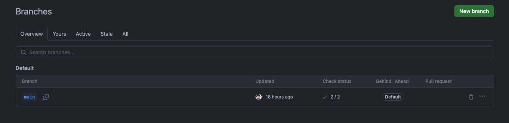

## 目次

1. [はじめに](#はじめに)
2. [GitHubのIssueの問題点](#githubのissueの問題点)
3. [Visual Studio CodeでのIssue管理の欠如](#visual-studio-codeでのissue管理の欠如)
4. [バージョン管理とブランチ管理](#バージョン管理とブランチ管理)
5. [個人開発におけるコードの管理](#個人開発におけるコードの管理)
6. [効果的なバージョンコントロールのための戦略](#効果的なバージョンコントロールのための戦略)
7. [結論](#結論)

## はじめに

Blogをふと見た時にブランチが一個しかないことに気がついた。

Githubpageではブログの記事を主に更新している。
その為ブランチが一つであれば、プッシュすれば
workflowが動きDeployが完了することはこのうえなく好ましい

だが私のブログではAIを活用している為、少しばかりのAPIを稼働させるアプリケーション機能がある。
これらのバージョンアップが必要で複数のブランチまたはバージョンを確保しておくことは重要と考える。

適切なブランチとバージョンの運営管理を考える

## GitHubのIssueの問題点

まず個人開発で起こりがちな(単に私が面倒くさがりだからか)Issueの管理ができていないことが問題で
何が現状の問題と把握して、何を解決してどう進んできたのかがIssueがないのでわからない。
メインブランチのみで運用するにしてもしないにしてもIssueに紐づいたブランチで作業を行いたい

Issue管理には以下のようなメリットが簡単に挙げられるだろう。

明確な問題追跡: Issueトラッキングシステムを使用することで、バグ、機能要求、その他のタスクを明確に文書化し、追跡することができます。これにより、何が解決される必要があるのか、どの問題が現在進行中であるのかが一目でわかる。

チームコミュニケーションの改善: Issueは、チームメンバー間のコミュニケーションを促進します。メンバーはIssueにコメントを残し、進捗を共有し、問題について議論できる。

優先順位付けとオーガナイズ: Issueを使うと、問題に優先順位をつけ、ラベルやマイルストーンを使用して整理することができます。これにより、チームや個人は最も重要なタスクに集中することができる。

透明性の向上: Issueトラッキングはプロジェクトの透明性を高める。チームメンバーやステークホルダーは、プロジェクトの進捗状況をリアルタイムで追跡し、どの問題が解決されたか、どの問題が未解決であるかを容易に把握できる。

履歴の保持: 各Issueにはそれを通じて行われたすべての議論や変更の履歴が保存される。これにより、将来的に同様の問題が発生した際に、過去の対応を参照することができる。

統合と自動化: 多くのIssueトラッキングシステムは、他のツール（バージョン管理システム、CI/CDパイプラインなど）と簡単に統合でき、作業の自動化が可能。例えば、特定のIssueがクローズされたときに自動的にビルドをトリガーするなど。

アクセス制御とセキュリティ: 企業や組織では、Issueトラッキングシステムを使用して、誰がどのIssueにアクセスできるかを厳密に制御できる。これにより、機密情報の流出を防ぐことができる。

Issueトラッキングシステムは、プロジェクトの進行をスムーズにし、効率を高めるための強力なツール。
正しく使用すれば、チームや個人の生産性を大幅に向上させることができるはず。

### Visual Studio CodeでのIssue管理の欠如

Visual Studio Codeを使用する際にIssueを管理できるようにしていなかった。
一般的なことかどうかはしらないが、どうしてもIssueはgithubでみてコメントをつけてスタンプをつけて
進行していく文化のままきていたので、エディター上で完結できるならばそれにこしたことはない。
というわけで試してみたいがそれ一つで記事が出来そうなので

[Visual Studio CodeでのIssue管理をやってみた](Issue-management-in-Visual-Studio-Code)

で記事を書くことにする。

### 個人開発におけるコードの管理

ここでは、個人開発の文脈において、コードの管理がどのように行われ、またなぜ「汚い」コードが問題にならなかったかについて掘り下げます。個人プロジェクトの自由度とリスクについても触れます。

### バージョン管理とブランチ管理

バージョン管理とブランチ管理の違いと、それぞれがプロジェクトにどのように影響を与えるかについて詳しく説明します。また、パッケージ管理の重要性にも触れ、これらの方法がどのようにプロジェクトの整理に役立つかを検討します。

### 効果的なバージョンコントロールのための戦略

ここでは、効果的なバージョンコントロールを実現するための戦略やベストプラクティスについて議論します。特に、個人開発とチーム開発の両方の文脈でのアプローチを考慮します。

### 結論

記事の終わりに、主なポイントを要約し、JekyllBlogのバージョンコントロールに関する効果的なアプローチを提案します。読者に対して、今後の開発における考慮事項やアクションプランを提示します。
