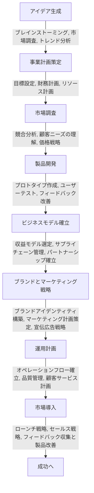

私はフリーランスでIT関連の新規事業の創出を行なっています。
今回は自分の整理をもとに流れを簡単に説明します。
大まかな流れなのでプロジェクトによるものではなく
業種関係なく一定のフローとして行えるものを整理してみようとおもいます。

## 目次

1. [新規事業のアイデア生成](#1-新規事業のアイデア生成)
2. [事業計画の策定](#2-事業計画の策定)
3. [市場調査の詳細](#3-市場調査の詳細)
4. [トレンド分析の手法](#4-トレンド分析の手法)
5. [製品開発への移行](#5-製品開発への移行)

## 1. 新規事業のアイデア生成

新規事業を立ち上げる際、最初のステップは魅力的なアイデアを生成することです。
ブレインストーミング、市場調査、トレンド分析などを通じて、実現可能で競争力のあるビジネスコンセプトを考案します。
この段階では、創造性とオープンマインドが重要です。

## 2. 事業計画の策定

アイデアが固まったら、それを実現するための事業計画を策定します。
目標設定、財務計画、リソース計画などを含め、事業の概要から詳細な戦略までを明確にします。
この計画は、事業のロードマップとして機能します。

## 3. 市場調査の詳細

市場調査は、事業成功の鍵です。
ターゲット市場の特定、競合分析、市場の傾向と機会の評価などを行い、市場に対する深い理解を築きます。
方法にはオンライン調査、面接、フォーカスグループなどがあります。

## 4. トレンド分析の手法

トレンド分析では、業界の最新動向や将来の傾向を把握します。
ソーシャルメディア、ニュース、業界レポートなどから得られるデータを分析し、事業戦略に反映させます。
トレンドの識別と影響分析が中心となります。

## 5. 製品開発への移行

市場調査とトレンド分析を基に、実際の製品開発に移行します。
この段階では、プロトタイプの作成、ユーザーテスト、フィードバックの収集と改善が重要です。
市場のニーズに合った製品を開発することが目標です。

最後に一連の流れを簡単に図としてまとめてみました。
各セクションで必要なことはもっと深ぼって話さなければいけないので
別の機会とします。

