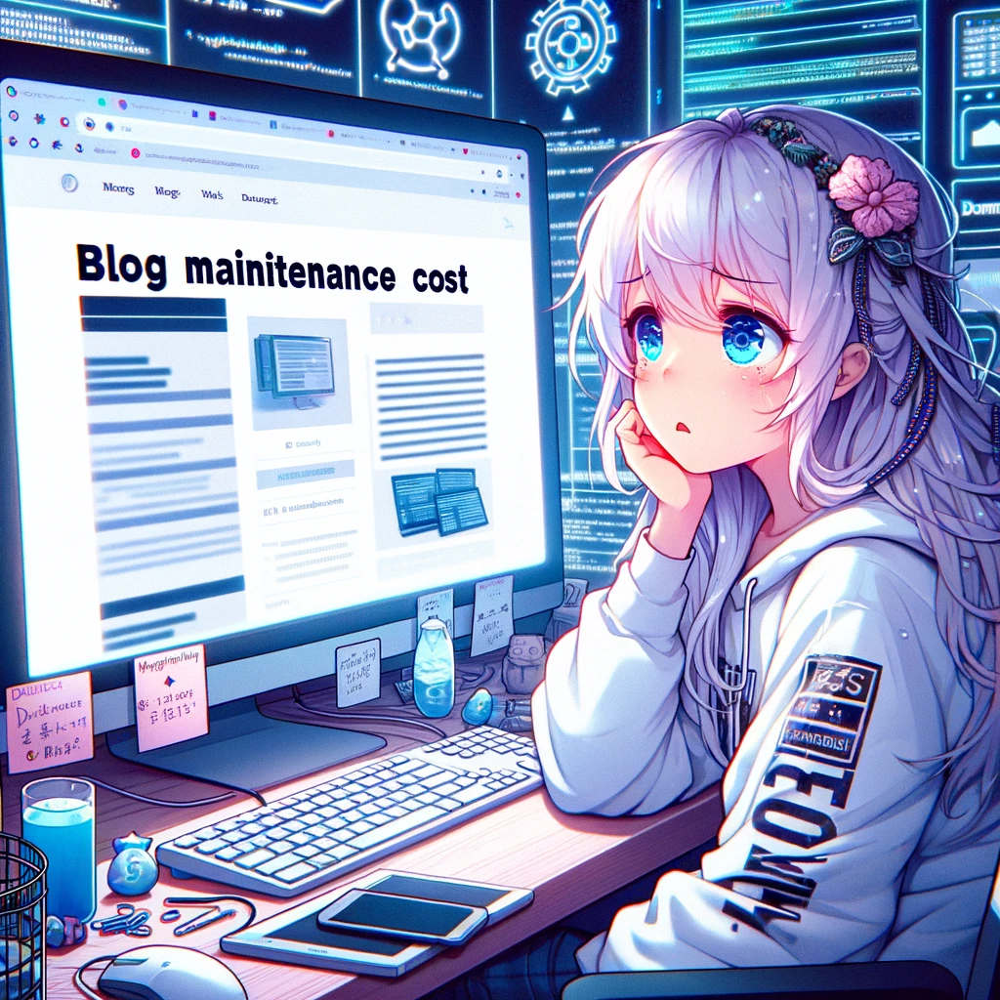

まずこのブログについて説明しよう。
このブログは以下の技術でできている。

- Jekyll：Rubyベースのフレームワーク
- GithubPage
- Forkした[jekyll-theme-yat](https://github.com/jeffreytse/jekyll-theme-yat)を修正して利用。
- chatGPTとのAPI連携

そしてこのブログのコンセプトは

- 圧倒的な低コスト(ドメイン更新料金のみ)
- 自動化されたデプロイ
- 簡略化されたブログ更新手順

という感じで常にブログに触れて開発を行えるのであればコードを公開しながら
細かいところを自分で開発して進められると思っていました。

ところがブログを久々に更新しようと思った時にかなり手間取った。
下記でそれを紹介しよう。

1. 開発環境の再構築
  久しぶりにブログを書こうと思って先ほどあげた環境でまずなにをしなくてはいけなくなったかというと開発環境の構築だった
  Rubyのバージョンを確認して、エディターを調整して、gitをクローンして、自分はブログを書いてちょっとしたニュースを更新したかっただけなのになんでこんなにも設定を行なっているのか疑問に思いながら開発環境を構築した。
  当然のことだった、ブログを書くツールに加えて、ブログを作るツールも動作させなければいけないんだから。

2. themeのアップデート
  次にthemeに対するアップデートを確認しなくてはいけなかった。
  私が利用しているthemeの開発者はコミュニティも活発で熱心にthemeのアップデートを行なってくれる(これはとても喜ばしいことだ)アップデートによる恩恵を受けるために私は数ヶ月分のコミットを眺めて、私がForkしたthemeに本当にエラーなくアップデートを受け入れられるか考えなくてはいけなかった。

3. GithubAction
  ようやく色々なアップデートを受け入れ、ローカルでの表示が問題ないことを確認して満足できた私はテストも兼ねてアップデートをデプロイしてみた。
  ローカルのビルドと本番のビルドやテストを通らないことはよくある経験だ、GithubActionのエラーを見直し、詳細に見てエラーの内容から適切な修正を試みた。

私は優秀で手の早いエンジニアではない。
過去にやった内容を全て覚えていられる脳を持っているわけでもない。
頭の悪いおじさんなので、これらの設定を一つ一つ思い出しながら、検索をしながら、新しい知識は勉強しながらクリアしていった。といっても私はブログを書きたかったのでかなり雑に行なった。

その結果スピードを重視して構築された現在の環境が再びできあがった!!
小規模な調整は必要だが、私はこれでブログを書くことができると喜んでコーヒーを入れてふと窓の外を見た。
すでに夕方だった。

私の頭の中はパニックになった、朝からやるはずだったタスクと計画が浮かんでは消えて
自分を落ち着ける為に、仕方なかった、必要な時間だった、これで明日からブログを書けるじゃないかと自分に言い聞かせた。

私は今、とても落ち着いた気持ちでこのブログを書いている。
釈迦かブッタ、もしくはヨガを終えた後のような清々しい気持ちで、山頂に登ったあとのコーヒーを飲むような気持ちで文字を打っている。

これがwordpressで構築したblogだったら？
noteやnotionを利用したblogだったら？

今頃私は、ちょっと気になったニュースに対して記事を作って、午後のティーブレイクを楽しんだ後に経営戦略の見直しや、ワークアウト、妻とのデートを楽しめていたのではないか？

私は開発の面白さや、複雑さによってかなりの時間を浪費しているのではないかと疑問に思うところでもある。

ブログを書くなら、誰にでも扱えるツールで、誰にでもできるように、書くことと伝えることに集中できればいいと思う。

私はもう一度ブログの管理を見直していこうと思った。

<a target="_blank" href="https://www.amazon.co.jp/gp/search?ie=UTF8&tag=tecmah-22&linkCode=ur2&linkId=caedbdbbe6ab06252509e0ad32e68dc6&camp=247&creative=1211&index=digital-text&keywords=ブログの作り方">ブログの作り方</a>で参考になりそうなkindle本をいくつか買うことにします。
多分wordpressだろうけど・・・・・

1.インタビューで出た課題はなにがあったのか
  - 課題の洗い出しと整理を行いました。
  - 小規模で限定的な意見や、重複する意見を削除するべきでしょうか。
2. 課題の中で強く解決を望まれた課題はなにか（課題の大きさ×課題があると答えた人数で定義）
  - 課題の大きさ×課題があると答えた人数の計算を以下で行いました。
    ◎と◯にの回答数に得点比重をつけて全員が◎と答えた場合を5点として計算しています。  
3.なぜその課題が起きるのか
  - 課題に対して解決したいと答えた人の問題対応に要するコスト・機会損失金額	問題の原因をまとめてあります。
4.我々が解決すべき課題はなにか（ほぼ2とイコールになる可能性はありますが…）
  - 配点を参照して上から見ることができます。
  - 少数意見に関しては配点が出ない為、削除するor参考意見として残すか相談させてください。

・10人へのラグがあるので
・フルネームとメール。

・コードタイプのほうが松浦→エンドユーザに配布できる。
・都度、依頼方法

何名分の発行をお願いします。

メモ
【確認したいこと】
どのくらいの期間行う予定か？？
配布頻度はどのくらいか？？
【Corp目線】
高頻度＆長期間（数ヶ月）ならコードタイプがベターかな？
コード発行からユーザー側DLまでの期限が90日なため、配布対象者確定のタイミングで都度コード発行した方が良い（ユーザーによってDL期限までのバッファがずれるのはナンセンス）
都度総務依頼を挙げて頂く形になる。
都度「何名分発行お願いします」で
余剰が発生してしまう可能性あり（まぁ、ストックしておけば良いのだけど）
配布対象が決まった時点で都度購入OKならメールタイプも可能
都度メールアドレス／フルネームの回収が必要
インタビュー回答者は可能かな？？一応確認
購入の都度でWチェック頂きたい

